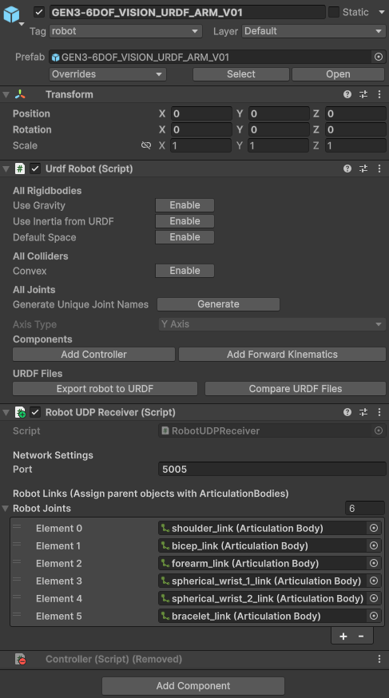
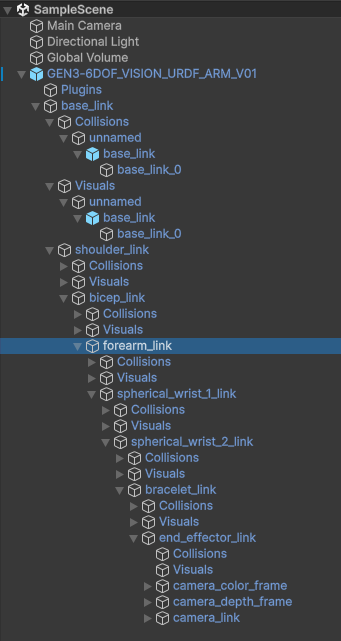
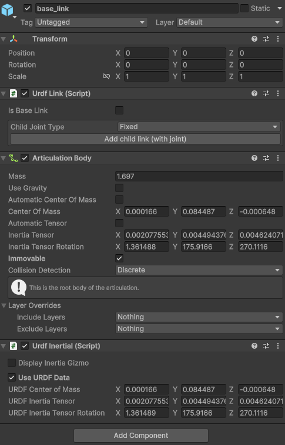
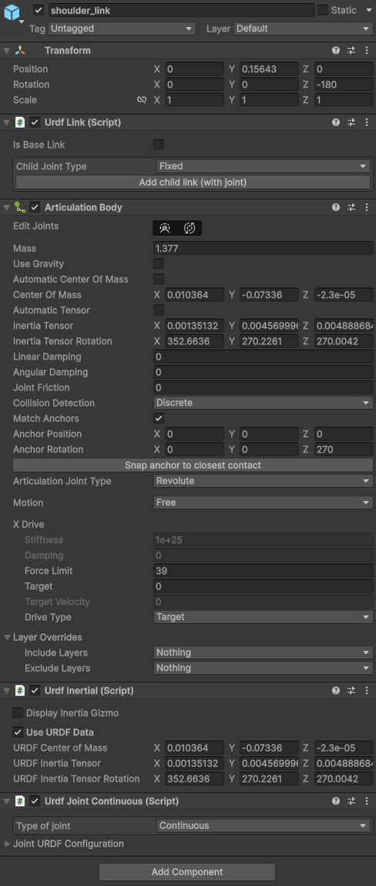
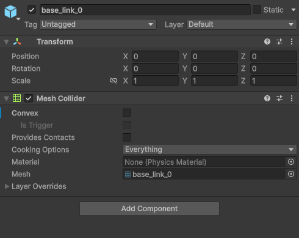
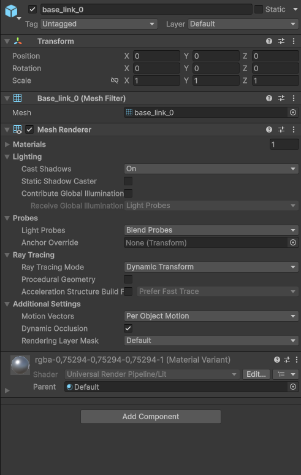

## Solution: Shortest-Path Joint Target Mapping

### Why the previous setup failed:
The previous receiver utilized an accumulated joint angle delta approach (`internalPhysicsTargets[i] += deltaAngle`). When the trajectory replay completed or reset, a sudden telemetric jump of `> 170` degrees would trigger a "jump reset", resetting the accumulator to the raw absolute angle. If the accumulator had wound up to e.g. `720.0` degrees and snapped back to `10.0` degrees, this resulted in a sudden **710-degree target change** in one frame, causing the ArticulationBody solver to explode and spin erratically.

### Fixed Implementation:
The refactored [RobotUDPReceiver.cs](file:///c:/Users/roman/Documents/GitHub/KinovaGen3-TeachUI/unity/RobotUDPReceiver.cs) resolves this by:
1. **Normalizing Targets**: Normalizes all incoming absolute Python target angles to `[-180, 180]` to perfectly align with Unity's internal physical joint space and clamp limits.
2. **Shortest-Path Delta Tracking**: Calculates the angular delta between the normalized target and our active setpoint target, unwrapping it using shortest-path normalization to create a continuous unwrapped target goal (`targetGoals[i]`).
3. **Startup Teleportation Protection**: On the very first telemetry packet received, the script **snaps the physical joint position instantly** (`ArticulationBody.jointPosition = new ArticulationReducedSpace(...)`) and sets the drive targets. This completely prevents the robot from violently whipping or exploding on startup (e.g. if Unity starts in a T-pose but the first packet is the home pose).
4. **Smooth Lerp-Interpolation (No-Staircase Glide)**: During active tracking, the script **never snaps physical joint positions** (which would reset velocities and cause stutters). Instead, to prevent staircase jumps and physics chattering caused by the low frequency of UDP packets (20Hz) relative to the physics rate (100Hz), it smoothly interpolates the active drive targets towards the goals using a time-corrected Lerp (`activeTargets[i] = Mathf.Lerp(activeTargets[i], targetGoals[i], 15f * Time.fixedDeltaTime)`) on **every single physics frame**. This delivers beautifully fluid, continuous movements even during extremely fast joint transitions (like the move from posID6 to posID7)! This guarantees that the target setpoints never experience instantaneous jumps larger than 180 degrees, keeping the digital twin perfectly stable.

---

## ⚙️ Recommended Unity Editor Configurations

To ensure maximum simulation stability for the robotic joint structures, please apply these project settings:

### 1. Physics Solver Settings
Go to **Edit > Project Settings > Physics**:
*   **Solver Type**: Set to **Temporal Gauss Seidel** (standard Gauss-Seidel is less stable for deep kinematic chains).
*   **Default Solver Iterations**: Increase to **30** or **50** (default is 6).
*   **Default Solver Velocity Iterations**: Increase to **10** or **20** (default is 1).

### 2. Time & Physics Update Frequency
Go to **Edit > Project Settings > Time**:
*   **Fixed Timestep**: Reduce to **0.01** or **0.005** (default is 0.02). This increases the physics loop frequency to 100Hz or 200Hz, ensuring exceptionally smooth tracking and eliminating joint jittering.

### 3. Joint Stiffness and Damping
In the Unity hierarchy, verify that the `ArticulationBody` components have appropriate `xDrive` gains (which the receiver script automatically configures at startup):
*   **Stiffness**: `10000` (provides high response tracking).
*   **Damping**: `500` (dampens oscillation).
*   **Force Limit**: `1000` (clamps peak physical torque spikes).

---

## 🤖 Python Mock Hardware Action Alignment

To ensure that the offline mock simulator behaves exactly like the real robot's internal shortest-path controller, we refactored [mock_kinova_hardware.py](file:///c:/Users/roman/Documents/GitHub/KinovaGen3-TeachUI/hardware/mock_kinova_hardware.py):
*   **The Problem**: While the real robot's Kortex API controller resolves shortest-path rotations internally, the offline Python mock script performed simple linear interpolation. This caused it to execute full 360-degree swings during actions (e.g. rotating `359°` forward instead of `-1°` backward), which streamed massive telemetry sweeps over UDP and caused wild spins in Unity.
*   **The Fix**: The mock hardware's joint interpolation pre-computes the mathematically optimal unwrapped target angles using shortest-path wrapping. The simulation now transitions seamlessly and identically to the real hardware, providing smooth continuous telemetry for actions, waypoints, and homing resets.